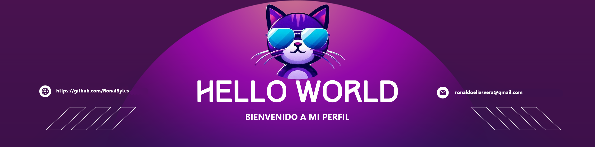

<!--Banner-->

<!--Night Owl image-->

  

<!--Header Name-->
#  Hola soy Ronaldo Elias! 
* Egresado en Ingenieria en sistemas computacional (Developer / Programmer)*
  

<!--Start Intro-->               

Soy un desarrollador Full Stack y entusiasta del aprendizaje automático con un gran amor por Java,Php, Laravel , Node.js, DevOps y visualización de datos.. 

- ✨ Bachiller en Ingenieria de sistemas!
- 🌱 Actualmente estoy aprendiendo muchas cosas, creo que cada día es una oportunidad de aprendizaje.
- ✍ Proximamente Nuevos desafios
- ❤ Contribuyendo con la comunidad.
- 💻 Gracias por visitar mi portafolio .
<!--End Intro-->

<!--Languages and Tools Section-->       
<h2 align="center">Tecnologias Utilizadas & Proyectos Recientes</h2> 
<picture>
  <source media="(prefers-color-scheme: dark)" srcset="./Skills_Animation_Dark.gif">
  <source media="(prefers-color-scheme: light)" srcset="./Skills_Animation_White.gif">
  
</picture>
 

<h3 align="left">Aprendizaje Actual</h3>
<ul align="left">
  <li>Profundizando mis conocimientos en el mundo backend.</li>
  <li>Explorando el mundo de machine learning y AI.</li>
  <li>Mejorando mis habilidad en computación en la nube con AWS y Azure.</li>
</ul>
  

 
 
 
 
 
 
 
 
 
 

<!--Profile Count Badge-->

  

---
 

<!--Languages and Tools Section-->       
<h2 align="center">Lenguajes y Herramientas</h2> 

 

<!--Trophies Section-->   

<!--Github stats Table--> 
<!-- Github stats Table -->
<h2 align="center">📊 Proyectos Laborales 📊</h2>

<table>
  <tr>
    <td width="50%">
      <h3 align="center">Sitio web para la gestión de inscripciones de estudiantes</h3>
      

        
        

          Responsable del desarrollo de la plataforma web para la gestión de inscripciones de estudiantes para un
          Instituto del Perú, bajo la gestión exclusiva de la empresa. Se implementaron funcionalidades para
          simplificar y automatizar el proceso de inscripción, mejorando la eficiencia administrativa y la experiencia
          del usuario.   
          <em>"Esta versión en GitHub es solo una demostración y no representa la plataforma en producción."
        

      

    </td>
<td width="50%">  
   
  <h3 align="center">Plataforma web para la autenticación y gestión integral del personal</h3>
      

        
        

          Lideré el desarrollo de una plataforma web para la autenticación y gestión integral del personal,
          optimizando los procesos internos y reforzando la seguridad de la información. Participé en el diseño y
          administración de bases de datos, aplicando principios avanzados de modelado de datos y utilizando
          tecnologías como PHP, Scriptcase, SQL Server, HTML5, CSS3+, JavaScript y Bootstrap.   
          <em>"Esta versión en GitHub es solo una demostración desarrollada desde cero y no representa la plataforma en producción."</em>
        

      

    </td>
  </tr>
  <!-- Proyecto 3 -->
    <td width="50%">
  <h3 align="center">Sistema de consulta de medicamentos - Galenos Loayza</h3>
  

    
    

      Desarrollo de un **sistema web interno** para el área de Farmacia del 
      <strong>Hospital Nacional Arzobispo Loayza</strong>, que permite consultar de forma rápida los medicamentos
      registrados en la base de datos **Galenos**.  
      La aplicación muestra resultados filtrados por nombre, código o presentación, 
      optimizando el tiempo de atención y evitando errores manuales.  
        
      <em>"Esta versión en GitHub es solo una demostración desarrollada desde cero y no representa la plataforma en producción."</em>
    

      

    </td>
     <!-- Proyecto 4 -->
    <td width="50%">
      <h3 align="center">Sistema de control de asistencia con QR y DNI - Hospital Arzobispo Loayza</h3>
      

        
        

          Sistema implementado en el Hospital Loayza que permite registrar el ingreso del personal
      mediante escaneo de código <em>QR</em> o búsqueda por <em>DNI</em>, verificando identidad y registrando
      automáticamente la hora de entrada; al confirmar, el sistema actualiza el estado a <strong>“Ingreso registrado”</strong>.
            
          <em>"Esta versión es solo una demostración desarrollada desde cero y no representa la plataforma en producción."</em>
        

      

    </td>
  </tr>

</table>

<!--Contact Section--> 

<h2 align="center">🤝 Conéctate conmigo. 🤝 </h2>

 
  

<!--Footer--> 

  

